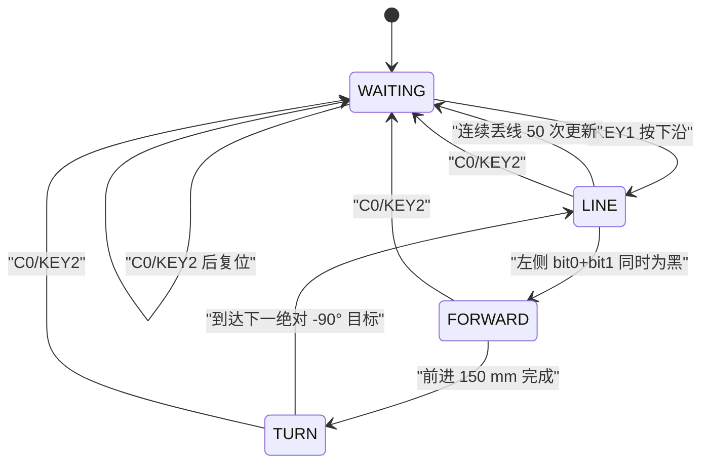
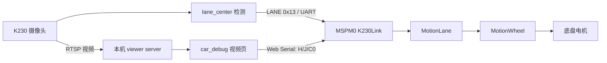

# 小车运动全场景与端到端调用链

> 核对基线：`car_msg3507@cc88b66`、`K230@d21268b`，均位于
> `feat/vision-lane-follow` 分支。核对日期：2026-07-28。
>
> 本文只把源码当前真实行为当作结论。仓库中的 README 和旧调用链文档有若干
> 已过期描述，本文第 13 节集中列出这些差异。

## 1. 先给结论

当前能让底盘运动的入口共有四类：

1. 网页或串口文本命令：`F/B/T/A/W/N/H/J/L/R/U`。
2. 车载按键任务：当前固件选择的是 25H，`KEY1` 启动任务，`KEY2` 急停。
3. 主车经 CarLink 转发给从车的命令：`@F500`、`@J250/250` 等。
4. K230 视觉巡道：K230 只发车道误差，仍需另行发送 `H<速度>` 才会起步。

所有闭环运动最终都汇合到同一条底层链路：

```text
上层入口
  -> MotionManager（唯一运动所有者）
  -> MotionStraight / Nav / MotionLine / MotionLane / SPEED / DRIVE
  -> MotionWheel（左右轮速度闭环）
  -> Motor（方向 GPIO + 物理左右通道映射）
  -> PWM（定时器比较值）
  -> 电机驱动器与左右电机
```

三个最容易误判的事实：

- 网页发 `F500` **完全不经过 K230**。即使网页同时显示 K230 的 RTSP 画面，
  控制字节仍从浏览器 Web Serial 直达 MSPM0 的 Serial1。
- 当前 K230 自动入口只运行 `lane_center`。`TARGET(0x10)` 虽能到达 MSPM0，
  但没有运动消费者；`LINE(0x11)` 在 MSPM0 端没有处理分支。
- 固件回复 `OK` 只表示动作成功启动，不表示动作已经走完。`F500` 完成时没有
  额外的文本 `DONE` 回包，网页主要通过遥测状态判断结束。

## 2. 当前启用状态

| 项目 | 当前状态 | 源码依据 | 对运动的含义 |
|---|---|---|---|
| MCU 主程序 | 已启用 25H | `main.c:1-18` | 上电进入 25H 的 `WAITING`，等 `KEY1` |
| 车角色默认值 | **SLAVE** | `Application/Core/CarRole.h:22-24` | 默认编译没有 `@` 转发入口，灰度为 5 路 |
| 网页本车命令 | 已启用 | `car_debug.html:331-369, 2457-2468` | 可直接控制与网页串口相连的那块 MCU |
| 网页从车命令 | 仅 MASTER 编译启用 | `BluetoothDebug.c:114-140, 806-833` | 命令以 `@` 开头，经 CarLink 发往从车 |
| K230 自动程序 | 已启用 `lane_center` | `D:\real\ti_23\K230\main.py:8-11` | 持续发送 `LANE(0x13)`，不会自行启动电机 |
| K230 视觉巡道 | 已接通 | `BluetoothDebug.c:639-685` | 原始终端发 `H200` 后才消费 LANE 并行驶 |
| K230 TARGET | 只接收缓存 | `K230Link.c:136-149, 364-371` | 当前没有调用 `K230Link_GetTarget()` 的业务代码 |
| K230 LINE | 发送端有、车端无 | `uart_io.py:649-705`，`K230Link.h:15-18` | 红线视觉结果当前不会驱动车轮 |
| 25E | 已实现但未选择 | `Accomplish/25E.c`，`main.c:1,11` | 改主程序选择后才运行 |
| TestApp/无刷云台测试 | 未选择 | `Application/Core/TestApp.c`、`Accomplish/Brushless_Motor_Test.c` | 不属于当前底盘运行入口 |

特别注意：`CarRole.h:11` 的注释仍写“默认 MASTER”，但真正的宏在
`CarRole.h:23` 是 `CAR_ROLE_SLAVE`。判断固件行为必须看宏，不要看旧注释。

## 3. 运行时总时序

系统节拍是 100 Hz，即正常情况下每 10 ms 一拍：

- `System/Tick.h:6-7` 定义 `TICK_HZ=100`、`TICK_DT=0.01f`。
- `SysTick_Handler()` 只累加拍数：`System/Tick.c:29-32`。
- 主循环只有取到拍数后才执行一次 App 和 Mission：`main.c:14-19`。

一拍内的关键顺序如下：

```mermaid
sequenceDiagram
    participant IRQ as "UART/编码器中断"
    participant App as "App_Update"
    participant Cmd as "BluetoothDebug"
    participant Link as "CarLink/K230Link"
    participant MM as "MotionManager"
    participant Mission as "Mission_Update"
    participant HW as "Motor/PWM"

    IRQ->>IRQ: "字节或编码器边沿只入缓冲/计数"
    App->>App: "Heading_Update + Odometry_Update"
    App->>Link: "CarLink_Update + K230Link_Update"
    App->>Cmd: "读取 Serial1 并解析网页命令"
    App->>App: "处理 C0/KEY2"
    App->>Link: "消费对端 CarLink 业务消息"
    App->>MM: "MotionManager_Update(dt)"
    MM->>HW: "本拍目标轮速 -> PWM"
    App-->>Mission: "返回本拍按键与 C 信号"
    Mission->>Mission: "检查动作完成/条件/转换"
    Mission->>MM: "转换时停止旧动作并启动新动作"
```

对应源码是 `Application/Core/App.c:173-285`：

1. `Heading_Update()`、`Odometry_Update()` 在 `196-197` 行先更新传感状态。
2. 按键边沿在 `201-205` 行形成。
3. CarLink 与 K230Link 在 `207-208` 行先收帧。
4. Serial1 文本命令在 `210-213` 行解析并取出 `C` 信号。
5. `KEY2` 被合成为 `C0`，见 `215-222` 行。
6. 本机 `C0` 在 `224-231` 行立即停止运动。
7. 对端 CarLink 消息在 `243-252` 行处理。
8. 当前运动控制器在 `254` 行更新并输出本拍 PWM。
9. `App_Update()` 返回后，`main.c:18` 才调用 `Mission_Update()`。

因此，网页命令可以在收到它的同一控制拍启动并输出第一拍 PWM；Mission 在该拍
末尾发生的状态转换，要到下一控制拍才第一次更新新动作。

本文后面出现的“30 ms / 300 ms / 500 ms”等拍数换算，都是主循环正常以 100 Hz
逐拍调用时的**标称墙钟时间**。MotionLine 丢线、MotionLane 丢道和 Nav 稳定计数
每次 `Update()` 只加 1，并不按 `elapsedTicks` 增加；若主循环阻塞后一次合并了多拍，
这些状态需要的实际墙钟时间会相应变长。MotionStraight 的速度斜坡则使用累计后的
`dt`，两类计时方式不要混为一谈。

## 4. 运动入口总表

### 4.1 底盘运动命令与共用速度配置

| 命令 | 含义 | 参数范围 | 控制器 | 自行完成条件 | 常用停止方式 |
|---|---|---:|---|---|---|
| `V200` | 只设置后续 F/B/T/A 的调试速度 | 20..800 mm/s | 无 | 立即完成 | 不需要 |
| `F500` | 前进 500 mm | 1..10000 mm | MotionStraight | 正常定距、减速、主动刹车；短距离例外见 6.1 | `C0` |
| `B500` | 后退 500 mm | 1..10000 mm | MotionStraight | 同 F，方向为负；短距离例外见 6.1 | `C0` |
| `T-90` | 相对当前累计航向转 -90° | -3600..3600° | Nav | 进入角度容差并连续稳定 3 拍 | `C0` |
| `A180` | 转到累计绝对航向 180° | -3600..3600° | Nav | 同 T | `C0` |
| `W300` | 双轮闭环恒速 300 mm/s | -800..800 mm/s | SPEED | 无，持续运行 | `W0` 或 `C0` |
| `J250/100` | 左右轮分别闭环到 250/100 mm/s | 每侧 -800..800 | DRIVE | 无，持续运行 | `J0/0` 或 `C0` |
| `N200` | 本地灰度巡线 | 20..800 mm/s | MotionLine | 连续全白 50 次更新后正常结束 | `N0` 或 `C0` |
| `H200` | K230 视觉巡道 | 20..800 mm/s | MotionLane | 视觉失效并确认 30 次更新后结束 | `H0` 或 `C0` |
| `L300` | 左轮开环 PWM | 最终夹到 -1000..1000 | 直接 Motor | 无 | `L0`、`U0`、`C0` |
| `R300` | 右轮开环 PWM | 最终夹到 -1000..1000 | 直接 Motor | 无 | `R0`、`U0`、`C0` |
| `U300` | 双轮同值开环 PWM | 最终夹到 -1000..1000 | 直接 Motor | 无 | `U0` 或 `C0` |
| `@<命令>` | MASTER 把命令转发给从车 | 文本收集上限 23 字符 | 从车复用同一解析器 | 取决于内层命令 | `@J0/0`、`@C0` 等 |

解析命令集合见 `BluetoothDebug_IsCommand()`：
`Application/Comms/BluetoothDebug.c:43-56`。参数范围见
`Application/Comms/BluetoothDebug.h:6-15`。

### 4.2 与运动相关但本身不让底盘起步

| 命令/入口 | 实际作用 |
|---|---|
| `C0` | 全局停止并让 Mission 复位到起始状态 |
| `C1..C255` | 发布任务信号；当前 25H 没有消费这些非零信号 |
| `Z1/Z2`、`E/Y` | 航向归零、零漂或尺度标定；运动时部分命令会被拒绝 |
| `K...` | 修改控制参数，影响后续或当前控制律，不单独起步 |
| `P<count>` | 请求 K230 拍照，不驱动车轮 |
| `O/D` | 更新 PA27/PA26 上的纵向/横向舵机 PWM，不是底盘运动 |
| `G/M/Q` | 遥测设置或查询，不驱动车轮 |

## 5. 实例一：网页发送 F500 的完整经历

本节假设：

- 网页已连接 Serial1，115200 8N1；
- 当前 `V=200 mm/s`，这是上电默认值；
- MotionManager 空闲，MPU6050 与里程计有效；
- 控制拍恰好是 10 ms，起步时航向误差和实测轮速都是 0。

### 5.1 浏览器生成字节

“前进 F”按钮在 `car_debug.html:340-343`：

```html
<input id="distVal" value="500">
<button data-send="F" data-from="distVal">前进 F</button>
```

统一事件绑定在 `car_debug.html:4481-4483`，得到字符串 `F500`。随后
`send()` 在 `car_debug.html:2457-2468`：

1. 去掉首尾空白；
2. 在终端打印 `> F500`；
3. 追加 `\r\n`；
4. 用 `TextEncoder` 写入 Web Serial。

实际发送字节是：

```text
46 35 30 30 0D 0A
 F  5  0  0 CR LF
```

这里不经过网页的视频服务器，也不经过 K230。

### 5.2 UART 中断只收字节

Serial1 初始化与 RX 上拉在 `Hardware/Comms/Serial.c:59-79`。
`BLUETOOTH_UART_INST_IRQHandler()` 位于 `Serial.c:364-395`：

1. 从 UART RX FIFO 逐字节读取；
2. 写入 `s_rxBuffer` 环形缓冲；
3. 推进 `s_writeIndex`；
4. 缓冲溢出时丢弃最旧数据；
5. 置 `Serial1_RxFlag`。

中断里没有字符串解析，没有调用 MotionManager，也没有写电机。

### 5.3 100 Hz 主循环解析 F500

下一次 `App_Update()` 在 `App.c:210-211` 调用：

```text
BluetoothDebug_Update(elapsedTicks, MotionManager_IsBusy() == 0)
```

`BluetoothDebug_Update()` 在 `BluetoothDebug.c:954-1003` 调用
`Serial1_ReadByte()` 取完当前缓冲，再逐字节调用
`BluetoothDebug_ProcessByte()`（`802-937`）：

| 输入字节 | 解析器动作 |
|---|---|
| `F` | `BluetoothDebug_StartCommand('F')`，清零数值累加器 |
| `5` | `magnitude=5`，标记已读到数字 |
| `0` | `magnitude=50` |
| `0` | `magnitude=500` |
| `CR` | 结束命令，调用 `BluetoothDebug_ExecuteCommand()` |
| `LF` | 此时解析器已复位，无命令可执行，忽略 |

即使发送端没有换行，连续空闲 3 个控制拍后也会执行，见
`BluetoothDebug.h:6-7` 和 `BluetoothDebug.c:979-1002`。

### 5.4 F 分支启动定距动作

F 分支在 `BluetoothDebug.c:450-463`，依次做：

1. `BluetoothDebug_RejectIfBusy()` 检查统一运动层是否忙；忙则返回 `ERR BUSY`。
2. 检查距离必须为 1..10000 mm。
3. 调用 `MotionManager_StartForward(500, 200.0f, 0.0f)`。
4. 启动成功立即把 `OK\r\n` 放进 Serial1 TX DMA 缓冲。

这里的 `OK` 是“参数合法且控制器已启动”，不是“已经走完 500 mm”。

### 5.5 MotionManager 取得运动所有权

调用链：

```text
BluetoothDebug_ExecuteCommand
  -> MotionManager_StartForward               MotionManager.c:193-209
     -> MotionManager_Stop                    MotionManager.c:449-488
     -> MotionStraight_StartForward            MotionStraight.c:426-431
        -> MotionStraight_Start                MotionStraight.c:376-424
```

启动时保存：

- 左右编码器累计距离起点；
- 总距离 500 mm、方向 `+1`；
- 巡航速度 200 mm/s、结束速度 0；
- 当前 `Heading_GetYaw()` 作为整段直线的目标航向；
- 距离与航向控制器运行状态。

若 Heading 离线或 `Odometry_CountsPerMM` 无效，启动返回传感器错误，网页看到
`ERR MOTION 3`，见 `MotionStraight.c:387-397`。

### 5.6 同一拍输出第一组 PWM

命令解析之后，`App.c:254` 当拍调用 `MotionManager_Update(dt)`：

```text
MotionManager_Update                       MotionManager.c:368-447
  -> MotionStraight_Update                MotionStraight.c:440-487
     -> CalculateTargetSpeedMagnitude      MotionStraight.c:208-250
     -> UpdateProfileSpeed                 MotionStraight.c:252-268
     -> ApplyWheelCommand                  MotionStraight.c:326-347
        -> MotionWheel_Update              MotionWheel.c:140-190
           -> Motor_SetPWM                 Motor.c:47-51
              -> Motor_SetLeftPWM/RightPWM Motor.c:31-45
                 -> PWM_SetCompareA/B      PWM.c:21-30
```

第一拍速度斜坡只从 0 增加到：

```text
300 mm/s^2 * 0.01 s = 3 mm/s
```

假设此刻两轮实测速度均为 0，航向误差也为 0，则航向修正为 0。按当前参数估算：

```text
左前馈 = 3 * 0.44573 + 19.884 = 21.22 PWM
左 P   = 0.6 * (3 - 0)         =  1.80 PWM
左输出约 23.02，取整为 23

右前馈 = 3 * 0.45788 + 22.205 = 23.58 PWM
右 P   = 0.6 * (3 - 0)         =  1.80 PWM
右输出约 25.38，取整为 25
```

参数来源是 `MotionWheel.h:19-28`，计算在 `MotionWheel.c:94-115, 164-188`。
后续每拍，编码器速度误差和航向误差都会改变最终输出。

底层还有一次物理接线映射：

- 逻辑左轮实际接驱动器 B 通道，正向命令在 `Motor.c:31-37` 映射到 BIN 与 CompareB；
- 逻辑右轮实际接驱动器 A 通道，在 `Motor.c:39-45` 映射到 AIN 与 CompareA；
- PWM 逻辑量 0..1000 换算到 1600 tick 周期，见 `PWM.c:4-12`。

实际引脚和外设配置在 `main.syscfg:44-51, 150-156, 177-199`：

| 功能 | MCU 资源 |
|---|---|
| 网页 Serial1 | UART2，TX=PA21、RX=PA22，115200 8N1 |
| 右轮方向 | PB25、PA12 |
| 左轮方向 | PB0、PB1 |
| 右轮 PWM | TIMG8 CCP0，PB15，驱动器 A 通道 |
| 左轮 PWM | TIMG8 CCP1，PB16，驱动器 B 通道 |

TIMG8 输入时钟为 32 MHz、周期 1600 tick，所以 PWM 频率是 20 kHz。

### 5.7 后续每 10 ms 如何闭环

每拍开始时，`App.c:196-197` 已先完成：

1. MPU6050 Z 轴角速度积分，更新累计航向和航向角速度；
2. 读取并清空左右编码器增量；
3. 用 `Odometry_CountsPerMM=6.44086` 换算左右距离和 mm/s 轮速；该初值由 1:20/48 mm 旧标定按 1:28/65 mm 新机械参数换算。

里程计算见 `Odometry.c:19-43`，编码器四相状态机见 `Encoder.c:64-84`。

MotionStraight 随后：

1. 用左右距离增量平均值计算已经前进多少；
2. 生成当前速度规划值；
3. 用航向 PD 产生左右相反的 PWM trim；
4. MotionWheel 对左右轮分别叠加前馈和 PI 速度反馈；
5. 输出新 GPIO/PWM。

### 5.8 500 mm 动作何时减速和完成

当前参数：

- 加速度：300 mm/s²；
- 减速起点：全程的 `5/6`；
- 距离容差：5 mm；
- 结束速度：0；
- 到点主动刹车保持：80 ms。

所以理想情况下：

```text
减速触发距离 = 500 * 5/6 = 416.67 mm
速度规划终点 = 500 - 5     = 495 mm
```

到达减速点时，代码根据当时实际规划速度和剩余距离计算本段固定减速度，公式位于
`MotionStraight.c:179-205`。到达 495 mm 且规划速度下降到 0 后：

1. `MotionStraight_StartBraking()` 调用 `Motor_Brake()`；
2. 两个 H 桥方向脚同时置高并给满占空，短接绕组吸收惯性；
3. 保持 80 ms；
4. `Motor_StopAll()` 释放方向脚和 PWM；
5. 状态变成 `COMPLETED`。

代码见 `MotionStraight.c:270-324, 440-487` 和 `Motor.c:53-78`。

按理想速度曲线粗略估计，500 mm 总过程约 3.2 s，再加 0.08 s 刹车保持。
实车时长会受轮速跟踪、打滑、控制拍合并和标定误差影响。

## 6. 网页与文本命令场景

### 6.1 F/B：前进或后退定距

F/B 共用 MotionStraight，区别只是距离方向：

- F 调 `MotionStraight_Start(+distance, ...)`；
- B 调 `MotionStraight_Start(-distance, ...)`；
- 两者启动时都锁定当前航向，不是纯左右轮同 PWM；
- 当前动作忙时拒绝新动作，不会覆盖正在执行的 Mission 动作；
- 正常长距离到点采用 80 ms 主动刹车；`C0` 中途停止则只是释放输出，不主动刹车。

网页 `V` 改的是后续 F/B/T/A 共用的 `s_debugSpeedMMps`，见
`BluetoothDebug.c:436-447`。V 不会改变已经在跑的 F/B。

硬件提示：网页 `car_debug.html:357` 明确标记“左轮硬件当前不能反转”。代码层支持
负轮速和 B 命令，但真实后退效果仍受这个已知硬件问题限制。

短距离还有一个必须单独对待的当前实现边界：

- `F1..F5` / `B1..B5` 参数合法，但距离不大于 5 mm 容差时，
  `MotionStraight_Start()` 会直接置为 `COMPLETED`；不会输出 PWM，也不会进入
  80 ms 主动刹车。
- `F6..F30` / `B6..B30` 会启动，但减速起点被夹到速度规划终点。第一次越过该点
  时，剩余减速距离已经不大于 0，`effectiveDecelerationMMps2` 保持为 0；目标速度
  虽变成 0，当前规划速度却无法下降，动作可能永不完成并继续行驶。
- 大于 30 mm 时有正常减速区；但若一次更新的里程增量直接跨过整个减速区，也可能
  触发同一问题。`F500` 的正常 10 ms 运行有约 78.33 mm 减速区，通常不会遇到，
  但它不是固件中的显式越界保护。

对应代码是 `MotionStraight.c:144-160, 179-205, 229-267, 306-323, 405-419`。
在这个规划缺陷修复前，不应把小于等于 30 mm 的 F/B 当作可靠点动命令；需要停车
时使用能实际到达固件的 `C0`。

### 6.2 T/A：相对转向和累计绝对角转向

调用链：

```text
T<角度> -> MotionManager_TurnBy -> Nav_StartBy
A<角度> -> MotionManager_TurnTo -> Nav_StartTo
                                  -> Nav_Start
```

对应 `BluetoothDebug.c:480-508`、`MotionManager.c:259-289`、
`Nav.c:102-130, 218-234`。

- T 的目标是 `当前 Heading + delta`。
- A 的目标就是给定累计角。
- Heading 不归一化到 ±180°，所以 `T720` 或 `A-450` 都有明确含义。
- 左右轮目标大小相等、方向相反，见 `Nav.c:185-194`。
- 请求速度会再被 `Nav_TuneMaxTurnSpeedMMps` 限制，默认上限是 200 mm/s；
  即使先发 `V800`，默认转向仍只到 200 mm/s。
- 剩余角小于 45°时进入低速区，默认最低 40 mm/s。
- 进入默认 ±2°容差后直接 `Motor_Brake()`，连续 3 次 Nav 更新后释放并完成，见
  `Nav.c:255-275`。

Nav 的“稳定 3 次更新”在正常 100 Hz 下标称约 30 ms，只看角度仍在容差内，
不检查实测轮速已经为零。

### 6.3 W：闭环恒速调试

`W300` 进入 MotionManager 的 SPEED 模式：

```text
BluetoothDebug W
  -> MotionManager_StartSpeed(300)
  -> 每拍构造 left=300, right=300
  -> MotionWheel_Update
```

代码见 `BluetoothDebug.c:552-593`、`MotionManager.c:291-315, 413-426`。

特点：

- 没有加减速规划；第一拍就是目标阶跃；
- 没有航向修正；
- 已经在 SPEED 时再次发 W，只改目标并保留左右 PID 状态；
- 没有自动完成条件，会一直运行；
- `W0` 只允许停止 SPEED 或空闲状态，不会拿来打断 F/T/N/H/J。

### 6.4 J：网页键盘差速驾驶

网页把油门与转向混合成左右轮速：

```text
base = throttle * speed
bias = steer * turn
left  = clamp(base + bias, -800, 800)
right = clamp(base - bias, -800, 800)
```

代码见 `car_debug.html:3813-3827`。例如档速 250、转向 150：

| 按键 | 发出的命令 | 运动效果 |
|---|---|---|
| W | `J250/250` | 直行 |
| S | `J-250/-250` | 后退 |
| A | `J-150/150` | 原地向一侧转 |
| D | `J150/-150` | 原地向另一侧转 |
| W+A | `J100/400` | 前进弧线 |
| 全松 | `J0/0` | 退出 DRIVE 并释放电机 |

网页只在按下沿和松开沿发送，重复帧会去重，见
`car_debug.html:3838-3888`。固件在两次命令之间持续闭环，不需要网页高频刷新。

固件解析 `J<左>/<右>` 在 `BluetoothDebug.c:222-276`：已经处于 DRIVE 时可以
连续改左右目标且不复位 PID；其他运动忙时返回 `ERR BUSY`。

风险边界：固件没有 DRIVE 看门狗。若浏览器、串口或无线链路在车辆运动时突然
断开，最后一个非零 J 目标会一直保持。只有网页正常收到 `keyup`、`blur`、Esc 或
执行正常断开流程时，才有机会把停车命令送到车上。

### 6.5 N：本地灰度巡线

`N200` 调用 `MotionManager_StartLine(200)`，再由 MotionLine 每拍直接读取车上
灰度 GPIO，不涉及 K230：

```text
Graydetect_GetState
  -> 位图按位置映射为离散权重
  -> 权重换成左右轮速度增减量
  -> MotionWheel_Update
```

关键源码：`BluetoothDebug.c:595-637`、`MotionLine.c:68-171, 194-247`。

- MASTER 编译为 8 路权重 `[-6,-4,-3,-1,1,3,4,6]`。
- SLAVE 编译为 5 路权重 `[-6,-3,0,3,6]`。
- 最外侧压线时，默认每侧最多增减巡航速度的 20%。
- 短暂全白会保持上一拍左右目标，不会立即停车。
- 连续全白 50 次 MotionLine 更新，即正常 100 Hz 下标称约 500 ms，才停止并标记
  正常完成。
- `N0` 只停止 LINE 或空闲模式。

### 6.6 H：K230 视觉巡道

这是当前唯一真正接通到车轮的 K230 视觉运动场景。完整链路见第 9 节。

网页当前没有 H 按钮，READY 横幅也没有列 H。使用方式是在网页“原始命令”输入框
或任一能写 Serial1 的串口终端发送：

```text
H200
H0
```

H 启动前只检查已经锁存的 K230 握手标志，不检查链路此刻是否仍在线，也不要求启动
后收到一帧新的 LANE。缓存里若有年龄不超过 10 拍的旧 LANE，会先使用旧帧；若从未
收到 LANE，则先保持初始的 0/0 目标，正常 100 Hz 下连续 30 次更新仍无有效视觉时
结束，标称约 300 ms。

H 也不检查 `Heading_IsReady()`。MotionLane 直接把 `Heading_GetYawRate()` 用作阻尼，
MPU/Heading 离线不会像 MotionStraight 或 Nav 那样触发传感器错误并自动停车；此时
视觉比例项仍可能继续驱动车辆，而 yaw 阻尼值取决于 Heading 模块当前保留的状态。
代码见 `MotionLane.c:161-162, 217-239`。

### 6.7 L/R/U：直接开环 PWM

L/R/U 不经过 MotionManager 和 MotionWheel，直接调用：

- `L` -> `Motor_SetLeftPWM()`；
- `R` -> `Motor_SetRightPWM()`；
- `U` -> `Motor_SetPWM()`。

分支见 `BluetoothDebug.c:332-364`。

这些命令只在 `MotionManager_IsBusy()==0` 的控制拍允许执行。它们不设置一个新的
MotionManager 模式：正常从 IDLE 执行后仍是 IDLE；若上一个 F/T/N/H 已完成但 mode
尚未清回 IDLE，则会保留那个旧 mode。无论哪种情况，都没有自动停止、编码器反馈、
航向保持或失联超时。适合台架检查方向和 PWM，不适合无人看守行驶。

### 6.8 网页自动调参试验

网页的“开始试验”没有另一条隐藏运动通路，只是编排已有命令：

- 轮速试验：`W<幅值>`，结束发 `W0`；
- 直线试验：`F<距离>`，异常收尾发 `C0`；
- 转向试验：`T<角度>`，异常收尾发 `C0`；
- 巡线试验：`N<速度>`，结束发 `N0`。

定义见 `car_debug.html:1616-1654`。网页通过遥测判断动作进入和退出，再记录或导出
数据；底层调用链仍分别等同 W/F/T/N。

只有这类由“开始试验”创建的调参会话带 30 s 网页保护：`startSession()` 在
`car_debug.html:3241-3242` 安排 guard timer，超时后 `stopSession()` 再调用
`emergencyStop()`。它不覆盖普通 WASD/J、单独 W、L/R/U 或原始终端命令，也不是
固件看门狗；网页崩溃或链路已经不可写时仍无法保证停车。

### 6.9 K1..K29：运行中调参如何影响运动

K 命令由 `BluetoothDebug.c:282-295` 转给 `Param_HandleCommand()`。常用格式：

```text
K?          查询全部 29 项
K27?        查询视觉巡道 Kp
K27=0.25    把视觉巡道 Kp 改为 0.25
```

参数表在 `Application/Debug/Param.c:133-176`，与运动控制器的对应关系如下：

| ID | 名称 | 影响的控制器 |
|---|---|---|
| K1..K5 | `wkp/wki/wil/wff/wsf` | 左右轮批量 PI、前馈和静摩擦 |
| K6..K8 | `skp/skd/sac` | MotionStraight 航向 PD 与加速度 |
| K9..K10 | `lra/lkd` | 本地灰度 MotionLine |
| K11..K14 | `nvx/nvn/nsa/ntl` | Nav 最大/最小速度、减速角、容差 |
| K15 | `gsc` | Heading 陀螺仪尺度 |
| K16 | `cpm` | 里程和轮速的编码器 counts/mm |
| K17..K21 | `lwkp..lwsf` | 左轮独立 PI、前馈和静摩擦 |
| K22..K26 | `rwkp..rwsf` | 右轮独立 PI、前馈和静摩擦 |
| K27..K29 | `vkp/vkd/vra` | K230 视觉 MotionLane |

PID 增益写入后会调用对应的 apply 函数；前馈、规划和比例类参数由控制循环每拍读取。
因此很多 K 写入对正在执行的动作也会立即生效，不是等下一次启动才生效。K 值只保存在
RAM；调试结果仍需写回头文件默认宏才能跨上电保留。

轮速 PID 还有一个运行中调参细节：`PID_Update()` 即使在 `Ki=0` 时也持续累计误差；
积分限幅为 0 在当前 `PID_Clamp()` 中表示“不限幅”。因此不要在车辆已经长时间存在
速度误差后只把 K2/K18/K23 的 Ki 从 0 改成正值；应先设置相应的正积分限幅
K3/K19/K24，并准备停车，否则已累计的积分会立即参与输出。

## 7. 主从车场景：@F500 与双车键盘驾驶

### 7.1 使用前提

两车必须编译成不同角色：

- 与网页 Serial1 相连的车：`CAR_ROLE_MASTER`；
- 接收转发命令的车：`CAR_ROLE_SLAVE`。

当前源码默认是 SLAVE，因此烧主车时必须通过编译宏或修改 `CarRole.h:23` 明确选择
MASTER。若两车都按当前默认编译，`@` 不会进入转发模式。

### 7.2 @F500 完整链路

```mermaid
sequenceDiagram
    participant Web as "网页"
    participant Master as "主车 BluetoothDebug"
    participant LinkM as "主车 CarLink/Serial2"
    participant LinkS as "从车 CarLink/Serial2"
    participant Slave as "从车 App/BluetoothDebug"
    participant Motion as "从车 MotionManager"

    Web->>Master: "@F500 + CRLF"
    Master->>LinkM: "RELAY_CMD，payload='F500'"
    Master-->>Web: "OK @F500（仅表示已尝试入链路）"
    LinkM->>LinkS: "HC05 二进制帧"
    LinkS->>Slave: "App_HandlePeerMessage(RELAY_CMD)"
    Slave->>Slave: "BluetoothDebug_FeedExternal('F500')"
    Slave->>Motion: "MotionManager_StartForward(500, V, 0)"
    Slave->>LinkS: "RELAY_REPLY，payload='OK CRLF'"
    LinkS->>LinkM: "HC05 二进制帧"
    LinkM-->>Web: "SLV OK"
```

具体函数：

1. MASTER 的 `BluetoothDebug_ProcessByte()` 在 `BluetoothDebug.c:806-833`
   识别 `@` 并收集该行。
2. `BluetoothDebug_FinalizeRelay()` 在 `116-139` 调
   `CarLink_SendCommand("F500")`。
3. `CarLink_SendCommand()` 在 `CarLink.c:418-437` 封装 `RELAY_CMD(0x10)`。
4. `CarLink_SendFrame()` 在 `128-166` 添加 `AA 55`、版本、序号、长度和 CRC，
   经 Serial2 DMA 发往 HC05。
5. 从车 `CarLink_Update()` 在 `348-392` 解析并入消息队列。
6. 从车 `App_HandlePeerMessage()` 在 `App.c:45-67` 捕获本地文本回应，调用
   `BluetoothDebug_FeedExternal()`。
7. `FeedExternal()` 在 `BluetoothDebug.c:1005-1023` 复用完整本地命令解析器并
   自动补换行，所以从 F 分支往下与本车 `F500` 完全相同。
8. 从车把捕获到的 `OK/ERR` 作为 `RELAY_REPLY` 发回；主车在
   `App.c:91-105` 加 `SLV ` 前缀转给网页。

网页先看到的 `OK @F500` 与后来的 `SLV OK` 含义不同：前者是主车本地收集完成，
后者才是从车解析和启动结果。

### 7.3 从车方向键驾驶

网页方向键使用独立状态，计算方式与主车 WASD 相同，但发送固定加 `@`：

```text
方向键 ↑ -> @J250/250
全部松开 -> @J0/0
```

代码见 `car_debug.html:4952-5004`。主车 WASD 与从车方向键可以同时按，因为最终
进入两块 MCU 上各自独立的 MotionManager。

### 7.4 CarLink 的运动安全边界

- 心跳每 0.5 s 一帧，2 s 无合法帧只把 `peerAlive` 置 0，见
  `CarLink.h:33-36`、`CarLink.c:361-391`。
- 对端掉线不会调用 MotionManager_Stop。正在运行的从车 J/W/L/R/U 不会自动停。
- Serial2 TX 满时 `CarLink_SendFrame()` 只累计 drop，见 `CarLink.c:161-165`；
  但 `CarLink_Send()` 在 `394-403` 仍无条件返回 1。因此主车可能回复
  `OK @F500`，而帧实际上已经因为 TX 缓冲满而丢失。
- CarLink 业务接收队列只有 6 槽。一次更新中入队超过 6 条时会丢最旧消息，且没有
  重传；较早的 RELAY_CMD 或 EVENT 0 停车事件也可能被后来的突发帧顶掉。代码见
  `CarLink.c:7-9, 84-110`。
- 从车收到 EVENT 0 时只执行 `MotionManager_Stop()+Motor_StopAll()`，没有给本地
  Mission 发布 C0。若本地 Mission 正在 FORWARD/TURN，随后 Mission 可能把“已停”
  解释为动作完成并进入下一状态，再次启动运动。代码在 `App.c:69-85`。
- `@C0` 作为 RELAY_CMD 能进入本地 C0 邮箱，但 peer 消息处理发生在本拍
  `BluetoothDebug_PopSignal()` 之后，因此真正的全局 C0 流程最迟下一拍执行。

## 8. 车载按键与任务状态机场景

### 8.1 当前上电运行的 25H

`main.c:10-12` 的启动顺序是：

```text
App_Init()
Mission_Init(Accomplish25H_GetMissionGraph())
Interrupt_Enable()
```

25H 状态图：



状态与参数位于 `Accomplish/25H.c:20-35`、`25H.h:15-37`：

- 巡线速度 200 mm/s；
- 左侧标志掩码 `0x03`，即 bit0 和 bit1 同时为 1；
- 离开标志线后前进 150 mm，速度 200 mm/s，结束速度 0；
- 每轮绝对目标减 90°；
- 转向请求速度 80 mm/s。

#### KEY1 启动

`App.c:201-205` 只在按键从松开变为按下的那拍设置 `pressedEdges`。
WAITING 的打断条件在 `25H.c:112-125` 检查 bit0。Mission 随后：

1. 退出 WAITING；
2. `MotionManager_Stop()`，所以能抢占 WAITING 时由网页启动的 W/J/F 等动作；
3. 进入 LINE；
4. 首次进入 LINE 保存当前 Heading 作为绝对角基准；
5. 调 `MotionManager_StartLine(200)`。

#### LINE 遇到左侧双黑线

MotionLine 在 App 前半拍已经根据本拍灰度输出过一次轮速。随后 Mission 在
`25H.c:131-142` 再读灰度；若 `state & 0x03 == 0x03`，立即停止 LINE 并进入
FORWARD。新直线控制器在下一拍第一次输出。

#### FORWARD 150 mm

`Accomplish25H_ForwardEnter()` 在 `25H.c:75-84` 启动与网页 F 相同的
MotionStraight。完成减速和 80 ms 主动刹车后，Mission 通过
`Mission_GetMotionActionStatus()` 看到 FINISHED，停止旧动作并进入 TURN。

#### TURN 后循环

`25H.c:90-103` 每次把绝对目标再减 90°。例如 KEY1 启动时 Heading 为 12°，
目标依次是 -78°、-168°、-258°。Nav 完成后回 LINE，不重新采基准。

#### 丢线和错误

- LINE 连续全白 50 拍后 MotionLine 正常完成，状态图回 WAITING。
- 运动模块报错时 `Mission.c:237-245` 调 `Mission_SetError()`，停车并进入 ERROR。
- ERROR 没有普通出口，C0 才会重置到 WAITING。
- KEY1 只在 WAITING 有转换；任务运行中按 KEY1 不会重启当前步骤。

### 8.2 KEY2 与 C0

KEY2 是按键位图 bit1。`App.c:215-222` 把 KEY2 按下沿合成为一条 C0，然后
`App.c:224-231` 当拍执行：

```text
MotionManager_Stop()
Motor_StopAll()
```

之后 `Mission_Update()` 在 `Mission.c:217-220` 无条件复位到起始状态，不受当前
状态的 `interruptible` 属性限制。

C0/KEY2 是释放式停车，不调用 `Motor_Brake()`。它与 F 到点、Nav 到角度容差时的
主动刹车不是同一种停车方式。

### 8.3 C1..C255 当前不会启动 25H

`C` 命令发布一个单槽信号，C0 优先级最高，普通信号同拍只保留最后一条，见
`BluetoothDebug.c:147-166`。但当前 25H 的条件只读取 KEY1 和灰度，不读取非零
蓝牙信号。因此：

- `C1` 在本车不会启动 25H；
- MASTER 会把 C1 作为 EVENT 发给从车；
- 从车对非零 EVENT 目前只鸣笛并回 ACK，见 `App.c:69-85`。

### 8.4 备用 25E 状态图

25E 已实现但 `main.c` 没有选择它。若以后切换图，其流程是：

```text
WAITING
  --KEY1--> 最多直行 2000 mm（300 mm/s）
  --连续 3 拍检测到任意黑线--> 灰度巡线（200 mm/s）
  --连续丢线 50 拍--> 转到启动航向 + 180°
  --> 再次直行并循环，每轮目标再 +180°
```

入口、条件和转换见 `Accomplish/25E.c:71-129, 137-247`，参数见
`Accomplish/25E.h:15-40`。若 2000 mm 内没有找到线，动作完成后回 WAITING。

## 9. K230 视觉巡道的完整链路

### 9.1 控制链与视频链是两条链



RTSP 只提供画面。视频页上的 WASD 最终仍调用网页的 `pressDrive()` 和 `send('J...')`，
见 `car_debug.html:657-681, 3766-3888`。

### 9.2 K230 启动与检测

当前 `D:\real\ti_23\K230\main.py:8-11` 调：

```python
from detectors.lane_center import run_lane_center_demo
run_lane_center_demo()
```

`run_lane_center_demo()` 在 `detectors/lane_center.py:587-697`：

1. 初始化 CameraIO；
2. 初始化 `TrackingUART`，失败时只停用串口，摄像头和 Wi-Fi 继续；
3. 每帧 `camera.snapshot()`；
4. `LaneCenterDetector.process(frame)`；
5. `tracking_uart.send_lane(result)`；
6. 显示检测叠加画面；
7. 用 LoopPacer 把循环最小周期限制为 33 ms 左右。

检测器在 `lane_center.py:326-471`：

- 把道路 ROI 缩放到 160x120；
- 阈值提取两侧黑线；
- 用 15 条水平扫描带寻找左右黑线内边界；
- 至少 4 条带有效才形成中心线；
- 在 5 个固定前视行插值得到偏差；
- 偏差使用千分比：`(画面中心X - 车道中心X) * 1000 / 画面宽度`；
- 无法覆盖某采样行时填 `-32768` 哨兵；
- 置信度由有效覆盖率和中心线连续性组合得到。

### 9.3 UART 握手与 LANE 帧

物理连接：

| K230 | 方向 | MSPM0 |
|---|---|---|
| UART2 GPIO11 TX（默认） | -> | UART3 PA25 RX |
| UART2 GPIO12 RX（默认） | <- | UART3 PA14 TX |
| GND | <-> | GND |

两端均为 115200 8N1。K230 默认会依次探测 UART2(GPIO11/12) 和
UART1(GPIO3/4)，配置见 `D:\real\ti_23\K230\config.py:46-80`。

统一帧格式：

```text
AA 55 | VER | TYPE | SEQ | LEN | PAYLOAD... | CRC8
```

CRC 使用 CRC-8/ATM，多项式 0x07，覆盖 `VER..PAYLOAD`。K230 构帧在
`core/uart_io.py:397-424`，MSPM0 构帧在 `K230Link.c:81-114`。

当前协议类型的实际落点如下：

| TYPE | 名称 | 当前生产者/消费者 | 是否接到底盘 |
|---:|---|---|---|
| `0x01` | READY | 两端握手 | 否 |
| `0x02` | READY_ACK | 两端握手确认 | 否 |
| `0x10` | TARGET | 多个 K230 检测程序发送，MSPM0 只缓存 | 否 |
| `0x11` | LINE | K230 `line_track.py` 可选发送，MSPM0 无处理分支 | 否 |
| `0x12` | DIGIT | K230 协议预留，当前无运动收发实现 | 否 |
| `0x13` | LANE | 当前 `lane_center` 发送，MotionLane 在 H 模式消费 | **是** |
| `0x20` | CAPTURE | MSPM0 的 P 命令发送，需 K230 CaptureService | 否 |
| `0x21` | CAPTURE_ACK | CaptureService 回复，MSPM0 上报结果 | 否 |
| `0x7F` | ECHO_PROBE | K230 自动探测串口使用，MSPM0 静默忽略 | 否 |

冷启动时两端都会发 `READY(0x01)`。准确的重试规则是：每一端只在“自己发出的
READY 尚未收到匹配 ACK”时每 100 ms 重发；无论自己是否已经握手完成，收到对方
READY 时仍会回复 `READY_ACK(0x02)`：

- K230：`uart_io.py:487-500, 557-603`；
- MSPM0：`K230Link.c:116-135, 321-336`；
- 重试周期配置见 `config.py:57-58` 和 `K230Link.h:21-22`。

#### 单边重启与掉线边界

这里存在一处确定性的状态不对称：

- K230 默认 `accept_ack_only=True`。只要自己的 READY 收到 ACK，
  `handshake_complete` 就为真，之后不再主动发 READY；见 `config.py:71-75`、
  `uart_io.py:324-371, 557-577`。
- MSPM0 的 `K230Link_IsReady()` 却同时要求 `peerReadyReceived` 和
  `readyAcknowledged`，见 `K230Link.c:358-361`。
- **只重启 K230 可以恢复**：重启后的 K230 发 READY，MSPM0 始终会回 ACK。
- **只重启 MSPM0、K230 不重启时不能恢复**：MSPM0 的新 READY 会得到 ACK，
  但 K230 已不再发送自己的 READY；MSPM0 的 `peerReadyReceived` 永远为 0，LANE
  会被拒收，`H200` 返回 `ERR K230 OFFLINE`。当前恢复方式是再重启 K230。
- 两端握手成功位都没有掉线超时。已经握手后直接拔掉 K230，H 的入口检查仍可能
  通过；若缓存里还有年龄不超过 10 拍的旧 LANE，会先按旧偏差输出，随后才走丢道
  保持和停车流程。

LANE 的 TYPE 是 `0x13`，12 字节 payload：

```text
valid:u8
b0:int16_le  b1:int16_le  b2:int16_le  b3:int16_le  b4:int16_le
confidence:u8
```

K230 构造 payload 在 `uart_io.py:707-768`。只有握手完成且距离上次实际发送至少
10 ms 才发；当前检测循环约 33 ms，所以通常每个检测帧发一帧。

例如序号 7、五带偏差 `[-100,-80,-60,-40,-20]`、置信度 80 的完整帧是：

```text
AA 55 01 13 07 0C 01 9C FF B0 FF C4 FF D8 FF EC FF 50 C1
```

其中负数按 int16 小端补码编码，最后的 `C1` 是本帧 CRC。

### 9.4 MSPM0 接收 LANE

UART3 中断 `Serial.c:581-618` 只把字节放入 Serial3 环形缓冲；缓冲满时丢当前
新字节并计数，后续解析靠 `AA 55` 重新同步。

每个 App 控制拍，`K230Link_Update()` 在 `K230Link.c:293-356` 最多解析 128 字节。
合法 LANE 在 `K230Link.c:150-174` 被解码为：

- `valid`；
- 5 个千分比偏差；
- 从哨兵计算出的 `bandValid` 位图；
- 0..100 置信度；
- 帧序号与 ageTicks。

链路层 `ageTicks` 达到 30（`>=30`）后，`K230Link_GetLane()` 返回 0，见
`K230Link.c:313-319, 374-382`。

### 9.5 H200 如何把视觉偏差变成轮速

网页原始终端发送 `H200` 后：

```text
BluetoothDebug H 分支                    BluetoothDebug.c:639-687
  -> K230Link_IsReady()
  -> MotionManager_StartLane(200)         MotionManager.c:244-257
  -> MotionLane_Start(200)                MotionLane.c:217-240
```

每拍 `MotionLane_ReadLane()` 要求：

1. K230Link 仍有未超时的 LANE；
2. LANE 年龄不超过 10 拍；
3. `valid=1`；
4. `confidence>=30`；
5. 五个带中至少一个不是哨兵。

然后从 b0 开始选择最近的有效带。控制律位于 `MotionLane.c:125-182`：

```text
laneError = -K230_offset_permille
adjust    = Kp * laneError - KdYaw * Heading_GetYawRate()
adjust    = clamp(adjust, +/- cruiseSpeed * maxAdjustRatio)
left      = cruiseSpeed + adjust
right     = cruiseSpeed - adjust
```

默认 `Kp=0.20`、`KdYaw=0.30`、最大修正比例 35%，见 `MotionLane.h:12-34`。

实例：K230 报最近有效带 `b0=-100`、置信度 80，当前 yaw rate 为 0，巡航速度
200 mm/s：

```text
laneError = -(-100) = +100
adjust    = 0.20 * 100 - 0.30 * 0 = +20 mm/s
left      = 200 + 20 = 220 mm/s
right     = 200 - 20 = 180 mm/s
```

车道中心在画面右侧时 K230 偏差为负，MSPM0 翻号后让左轮更快、右轮更慢，车辆向
右修正。220/180 随后进入与 F/J 相同的 MotionWheel、Motor、PWM 链路。

### 9.6 视觉短时丢失与停车

MotionLane 有两层新鲜度。主循环稳定 100 Hz 时：

- 控制层接受 `ageTicks<=10`，即最多使用约 100 ms 的旧 LANE；
- 从 `ageTicks=11` 起判为无效，前 29 次无效更新保持最后目标，第 30 次停止，
  这段标称约 300 ms；
- 两段合计约 400 ms，然后 `MotionWheel_Stop()` 并正常完成。

代码见 `MotionLane.h:22-34`、`MotionLane.c:89-147, 242-266`。

`lostTicks` 是每次 `MotionLane_Update()` 加 1，不使用 `elapsedTicks`。因此约 400 ms
不是调度停顿时仍成立的硬实时上界；主循环合并多拍时，实际墙钟时间会更长。

“保持最后目标”不是保持 0：若丢失前正在 220/180 mm/s 转弯，短时丢失期间仍会
继续用 220/180。调试与安全评估时要按这个真实行为考虑。

## 10. 当前不可达或不驱动底盘的分支

### 10.1 K230 其他程序为什么不会让车动

| K230 程序 | 发出的信息 | MSPM0 当前处理 | 运动结果 |
|---|---|---|---|
| `lane_center.py` | `LANE 0x13` | MotionLane 消费 | **已接通，需 H 启动** |
| `color_spot.py` | `TARGET 0x10` | 只缓存 | 不动 |
| `rectangle.py` | `TARGET 0x10` | 只缓存 | 不动 |
| `pencil_rectangle.py` | `TARGET 0x10` | 只缓存 | 不动 |
| `rectangle_corner_cycle.py` | `TARGET 0x10` | 只缓存 | 不动 |
| `line_track.py` | 可选 `LINE 0x11`，默认关闭 UART | 无类型分支，静默忽略 | 不动 |
| `digit.py` | 当前不发运动帧 | 无 | 不动 |
| `rectangle_distance.py` | 当前不发运动帧 | 无 | 不动 |
| `road_symbol.py` | 当前不发运动帧 | 无 | 不动 |
| `steelball.py` | 当前不发运动帧 | 无 | 不动 |
| `steelball_distance.py` | 当前不发运动帧 | 无 | 不动 |
| `core/bluetooth_uart.py` | K230 本地单字符缓存 | 未连接 MCU 运动 API | 不动 |
| `tools/capture.py` | 收 `CAPTURE 0x20`、回 `ACK 0x21` | 拍照业务 | 不动 |

历史兼容入口只转调上述程序：`color.py` 等同 `color_spot.py`，`corner_cycle.py` 等同
`rectangle_corner_cycle.py`，`line.py` 等同 `line_track.py`，`tangle.py` 等同
`rectangle.py`；`num.py`、`road.py`、`square_distance.py`、`steelball_detect.py` 分别
转调无运动帧的数字、道路符号、距离和钢球程序。因此换成兼容文件名也不会产生一条
新的底盘控制链。

TARGET 发送点包括：

- `color_spot.py:584-600`；
- `rectangle.py:917-922`；
- `pencil_rectangle.py:895-910`；
- `rectangle_corner_cycle.py:329-342`。

车端只在 `K230Link.c:136-149` 保存 TARGET。全仓库除接口自身外没有
`K230Link_GetTarget()` 调用者，所以“目标偏差已收到”不等于“底盘正在追踪目标”。

`rectangle.py` 的 `run_rectangle_tracking()` 名称也容易误导：其发送偏差取自
`ColorSpotDetector`，见 `rectangle.py:887-921`；方框结果主要用于显示。但无论偏差
来源是什么，TARGET 当前都没有底盘控制器消费。

`line_track.py:743-869` 的 `enable_uart` 默认是 False；手动打开后可发送 LINE，
发送点在 `814-815`。MSPM0 的
`K230Link.h:15-18` 只定义 READY、READY_ACK、TARGET、LANE，没有 LINE 0x11，
因此它不会落到本地 MotionLine。本地 N 巡线始终读取车载灰度 GPIO。

`core/bluetooth_uart.py:38, 108-136` 只缓存字符 `1/2/3/4/s/p`，没有映射到 MSPM0
运动命令。它默认也占用 UART2 GPIO11/12，但波特率是 9600；TrackingUART 默认用
同一组引脚、115200，不能同时接不同设备。配置依据是 `config.py:49-52, 199-207`。

当前 K230 `main.py` 也没有运行 `tools/capture.py`，所以网页发 P 时即使握手已完成，
lane_center 主循环也不会消费 CAPTURE 请求或回 ACK；MSPM0 最终会在 1 s 后按失败
上报。拍照服务入口与行为见 `tools/capture.py:176-225`。

即使以后把 K230 入口切到 CaptureService，`P<count>` 的 `count>1` 也不是“整批完成
后确认”：K230 每保存一张就发一次 ACK（`capture.py:208-217`），MSPM0 收到第一张
ACK 就清除 pending（`K230Link.c:175-184`），后续 ACK 会被忽略。因此网页成功回报
只证明第一张完成，不证明整批都完成。

### 10.2 MSPM0 侧的保留代码

| 保留代码 | 当前可达性 | 说明 |
|---|---|---|
| `MotionManager_StartBrake()` | 无调用者 | API 和实现存在，但 25H/25E 都没有使用 |
| `Motor_Run/Forward/Backward/TurnLeft/TurnRight/Spin*()` | 无调用者 | 兼容便捷函数；当前命令和任务不走这些包装 |
| `TestApp_Init/TestApp_Update` | `main.c` 未调用 | 测试专用入口，不是当前固件主循环 |
| `BrushlessMotorTest_GetMissionGraph()` | `main.c` 未选择 | 控制的是 F32C 云台无刷电机，不是底盘 |
| `Gimbal_Update()` | App 中被注释 | Serial2 已改作 HC05 CarLink，当前整车流程停用云台 |
| 普通舵机 PWM | `SERVO_ENABLED=1` | O/D 更新 TIMG7 比较值，由 PA27/PA26 输出 50 Hz PWM |

依据分别见 `MotionManager.c:347-366`、`Motor.c:81-88`、`TestApp.c:15-79`、
`Brushless_Motor_Test.c:234-245`、`App.c:198-200`、`Servo.h:6-12`、
`Servo.c:39-73`。这些代码存在不代表上电后会执行。

## 11. 停车、抢占和异常场景

### 11.1 网页急停按钮、Esc、失焦和断开

网页 `emergencyStop()` 在 `car_debug.html:3368-3383` 依次尝试发送：

```text
当前试验专用停止命令（如有）
J0/0
@J0/0
W0
N0
C0
U0
```

按钮和 Esc 入口分别在 `car_debug.html:4473-4478, 5102-5112`。浏览器窗口失焦时
会清空主从两套按键并发 J 停车帧，见 `5115-5120`。主动断开串口前也先调用急停，
见 `2417-2445`。

这些都是“链路仍可写时的尽力发送”。拔线、浏览器崩溃、电脑休眠或无线断链时，
网页无法把停车字节送达，固件侧又没有统一失联看门狗。

### 11.2 不同停止方式的实际区别

| 停止场景 | 最终硬件动作 | 是否主动刹车 |
|---|---|---|
| F/B 正常长距离到点 | `Motor_Brake()` 80 ms 后 `Motor_StopAll()` | 是；1..5 mm 例外 |
| T/A 进入角度容差 | 每次更新 `Motor_Brake()`，稳定 3 次后释放 | 是 |
| C0 / KEY2 | `MotionManager_Stop()` + `Motor_StopAll()` | 否 |
| 被各自处理器接受时的 W0/J0/N0/H0 | 对应 Stop -> `MotionWheel_Stop()` | 否 |
| 灰度确认丢线 | `MotionWheel_Stop()` | 否 |
| 视觉确认丢失 | `MotionWheel_Stop()` | 否 |
| MotionWheel 或子控制器显式检查到的传感器错误 | 子控制器 Stop | 否 |

`MotionManager_StartBrake()` 虽有实现，但当前全仓库没有调用者，不应把它算作实际
任务流程中的额外刹车阶段。

### 11.3 运动互斥和抢占规则

- MotionManager 任意时刻只维护一个模式，枚举见 `MotionManager.h:17-28`。
- 网页 F/B/T/A 在忙时拒绝；W/N/H/J 只允许同模式连续更新，或在
  `MotionManager_IsBusy()==0` 时启动。
- W/J 在同模式下只更新目标并保留 PID；N/H 在同模式下会先 Stop 再重新 Start。
- L/R/U 只要求 `MotionManager_IsBusy()==0`，不要求 mode 必须是 IDLE；所以刚完成但
  mode 尚残留的 F/T/N/H 之后也会放行。
- C0 和 KEY2 始终可停止，不受状态是否可打断限制。
- Mission 转换会无条件 `MotionManager_Stop()`，所以 WAITING 时按 KEY1 可以抢占
  网页启动的动作；网页可能已经先收到 `OK`。
- 网页动作与 Mission 共用同一个 MotionManager，但没有独立“所有者 ID”。例如
  WAITING 期间网页动作发生运行错误，Mission 也会看到全局 MotionManager 错误并
  进入自己的 ERROR 状态。
- F/T/N/H 子控制器完成后，MotionManager 不会自动把 `mode` 改成 IDLE；只是
  `IsBusy()` 变成 0。此时可启动新动作，L/R/U 也会被允许，但与残留 mode 不匹配的
  `W0/N0/H0` 仍可能返回 `ERR BUSY`。在这种“动作已完成、IsBusy=0”的场景，
  `J0/0` 会调用 Stop 清回 IDLE；若其他模式仍在忙，J0/0 会先返回 `ERR BUSY`。
  只有 C0/KEY2 是不看当前 mode 和 busy 状态的全局停止。

### 11.4 故障保护缺口与已知运动边界

当前实现没有：

- J/W/L/R/U 串口失联超时；
- CarLink 掉线自动停车；
- 通用动作最长运行时间；
- 电机堵转检测；
- 过流保护的软件输入；
- F/B 编码器无脉冲超时。

因此编码器断线时，F/B 可能永远认为距离未到并持续输出。当前默认左右轮 `Ki=0`，
输出不会随时间持续积分上升，而是维持“速度前馈 + 固定 P 误差 + 上层 trim”。
PID 内部仍在累计误差；若运行时把 Ki 调成正值，累计值开始参与输出，才可能把输出
推到 PWM 限幅，见 `MotionWheel.c:167-185`、`PID.c:39-57`。

此外，6.1 所述 MotionStraight 规划缺陷使 6..30 mm 动作可能越过终点后持续行驶；
较长动作若单次里程更新跨过完整减速区也有同类风险。它与编码器硬件故障不同，但
同样没有动作超时兜底。此处都是当前源码行为，不应把“有闭环”误当成“已有全部故障
保护”。

传感器检查也不是所有模式统一执行：F/B 检查 Heading 与里程标定，T/A 检查
Heading，MotionWheel 检查里程标定；H 不检查 Heading 是否 ready，N 也不使用
Heading。排查某个模式时应看该子控制器自己的前置条件，不能把 F500 的传感器错误
行为直接套到 H200。

## 12. 快速排查：命令发出后车为什么不动

### F500

1. 网页是否打印 `> F500`，串口是否 115200 8N1。
2. 是否收到 `ERR BUSY`、`ERR RANGE` 或 `ERR MOTION 3`。
3. Heading/MPU6050 是否 ready，`Odometry_CountsPerMM` 是否有效。
4. 当前是不是按下 KEY1 后被 Mission 立刻抢占。
5. 看遥测目标轮速是否从 0 按 3 mm/s/拍上升。
6. 有目标无 PWM：查 MotionWheel 参数有效性；有 PWM 无转动：查驱动与接线。
7. 换成短距离测试时要先看 6.1：1..5 mm 本来就不驱动，6..30 mm 有越界后持续
   行驶的已知规划缺陷，不能用来判断 F500 主链是否正常。

### H200

1. 必须在“原始命令”发送，当前网页没有 H 按钮。
2. `ERR K230 OFFLINE` 表示双向 READY/ACK 未完成。
3. K230 `main.py` 是否确实运行 lane_center，而不是 TARGET 或 LINE 程序。
4. K230 是否打印串口握手完成；UART TX/RX 是否交叉并共地。
5. LANE 的 valid、confidence、bandValid 和 age 是否达标。
6. H 只启动底盘，K230 单独运行不会自行起步。
7. 若只是 MSPM0 重启过而 K230 一直未重启，当前握手状态机不会自行恢复；再重启
   K230。反过来，K230 单独重启可以恢复。
8. H 返回 OK 也不等于链路此刻在线，因为握手成功位不会超时清除；继续看 LANE
   年龄与 MotionLane 状态。

### @F500 / 从车方向键

1. 网页连接的固件必须是 MASTER，当前源码默认不是。
2. 先区分 `OK @F500` 和 `SLV OK`；只有后者证明从车已执行解析。
3. 没有 `SLV` 回包时检查 HC05、Serial2、角色与 CarLink TX drop。
4. `peerAlive` 只用于显示链路状态，不会替正在跑的车停车。

### N200

1. N 读取车载灰度，不读取 K230 红线检测。
2. 当前默认 SLAVE 编译只使用 5 路；MASTER 使用 8 路。
3. 灰度返回 1 表示黑线，输入极性与上拉是否符合硬件。
4. 主循环稳定 100 Hz 时，全白后会继续保持最后速度标称约 500 ms，再停车；
   合并多拍时实际墙钟时间更长。

## 13. 已确认的文档或接口偏差

以下结论来自当前源码，阅读旧 README、`tutorial/` 和网页内置说明时应以此修正：

1. 当前 `CAR_ROLE` 默认是 SLAVE，不是注释所称的 MASTER。
2. 命令解析器已经有 J 和 H；README/READY 横幅未完整列出 H。
3. 运行时 K 参数已到 K29，不是旧文档中的 26 项。
4. MotionStraight 的正常长距离零结束速度会主动刹车 80 ms，不是单纯释放；
   1..5 mm 立即完成是例外。
5. Nav 进入容差后直接主动刹车并计 3 次更新，不等待轮速归零。
6. Serial3 RX 满时丢当前新字节并继续靠帧头重同步，不是熔断接收。
7. K230 TARGET 当前没有运动消费者，LINE 当前不被车端处理。
8. RTSP 画面不承载网页 WASD 控制；控制仍走 Web Serial 的 J 命令。
9. `CarLink.h:59-61` 注释称 TX 满时发送返回 0，但 `CarLink_Send()` 当前总返回 1。
10. 当前 K230 主入口没有运行 CaptureService，P 请求不会在 lane_center 中处理。
11. K230 默认允许“只收到自己的 READY_ACK”即握手完成，MSPM0 却要求双向 READY；
    因此 MSPM0 单独重启时会形成不能自动恢复的状态。
12. MotionStraight 的 6..30 mm 合法输入存在零减速度规划缺陷，不能视为可靠点动。
13. `car_debug.html:1642` 仍写 Nav 要等“轮速归零后连续 3 拍”；真实代码只检查角度
    容差并主动刹车 3 次更新，不检查轮速归零。
14. `tutorial/index.html:303, 373, 10220` 等处断言 `main.c` 当前加载
    `AccomplishTest`；那是旧版本快照。当前 `main.c:1-18` 明确加载 25H，教程中的
    Test 任务结论不可用于当前固件。

## 14. 关键源码索引

### MSPM0 侧

| 层次 | 文件与关键行 |
|---|---|
| 主入口 | `main.c:6-20` |
| 100 Hz 编排 | `Application/Core/App.c:130-285` |
| 网页文本协议 | `Application/Comms/BluetoothDebug.c:43-56, 278-783, 802-1023` |
| Serial1/2/3 | `Hardware/Comms/Serial.c:59-239, 241-430, 433-618` |
| 统一运动管理 | `Application/Control/MotionManager.c:168-549` |
| 定距直线 | `Application/Control/MotionStraight.c:125-324, 376-541` |
| 双轮闭环 | `Application/Control/MotionWheel.c:94-223` |
| 转向 | `Application/Control/Nav.c:102-194, 218-294` |
| 本地灰度巡线 | `Application/Control/MotionLine.c:68-171, 194-255` |
| K230 视觉巡道 | `Application/Control/MotionLane.c:73-194, 217-281` |
| K230 协议 | `Application/Comms/K230Link.c:81-186, 188-430` |
| 主从车协议 | `Application/Comms/CarLink.c:84-248, 329-469` |
| Mission 引擎 | `Application/Mission/Mission.c:73-181, 184-310` |
| 当前 25H | `Accomplish/25H.c:38-243` |
| 备用 25E | `Accomplish/25E.c:49-325` |
| 里程与编码器 | `Application/State/Odometry.c:13-78`、`Hardware/Motor/Encoder.c:25-102` |
| 电机与 PWM | `Hardware/Motor/Motor.c:25-88`、`Hardware/Motor/PWM.c:4-30` |
| 网页 | `car_debug.html:2291-2506, 3368-3400, 3764-3888, 4471-4486, 4952-5004, 5102-5120` |

### K230 侧

根目录：`D:\real\ti_23\K230`。

| 层次 | 文件与关键行 |
|---|---|
| 当前入口 | `main.py:8-11` |
| UART/帧/握手 | `core/uart_io.py:151-169, 172-321, 324-768` |
| 车道检测与主循环 | `detectors/lane_center.py:77-471, 587-697` |
| UART 与巡道配置 | `config.py:46-80, 447-504` |
| TARGET 示例 | `detectors/color_spot.py:546-628`、`detectors/rectangle.py:832-955` |
| K230 红线 LINE | `detectors/line_track.py:743-869` |
| 拍照服务 | `tools/capture.py:29-173, 176-225` |

## 15. 一句话心智模型

把整个系统记成下面三句话即可：

1. 网页、按键和主从链路决定“现在要做哪一种运动”。
2. K230 当前只为 H 模式提供“车道偏到哪边”的测量，不负责发起行驶。
3. 所有闭环运动最终都由 MotionWheel 把目标 mm/s 变成左右 PWM；L/R/U 是唯一绕过
   这条闭环链路的底盘命令。
